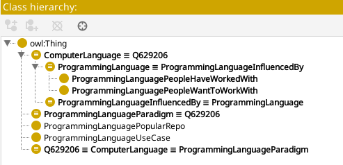
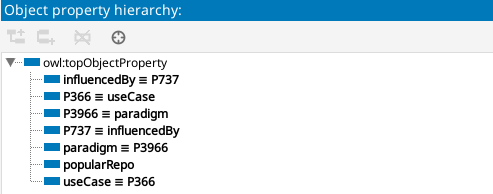
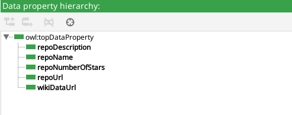
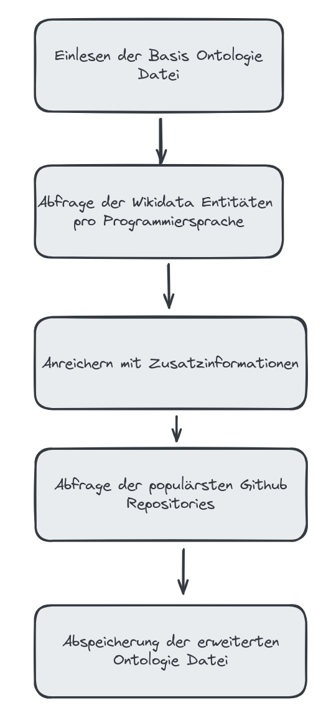
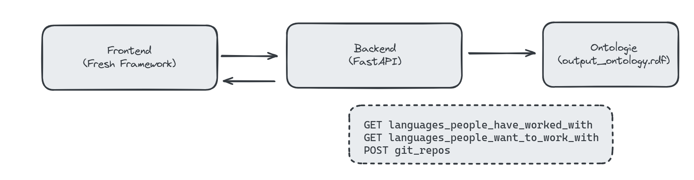
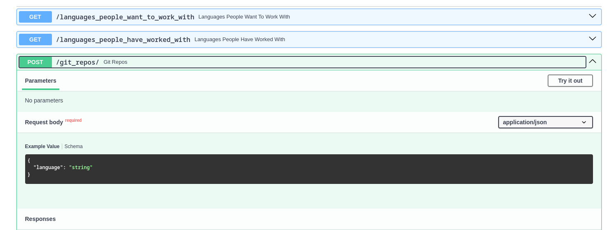
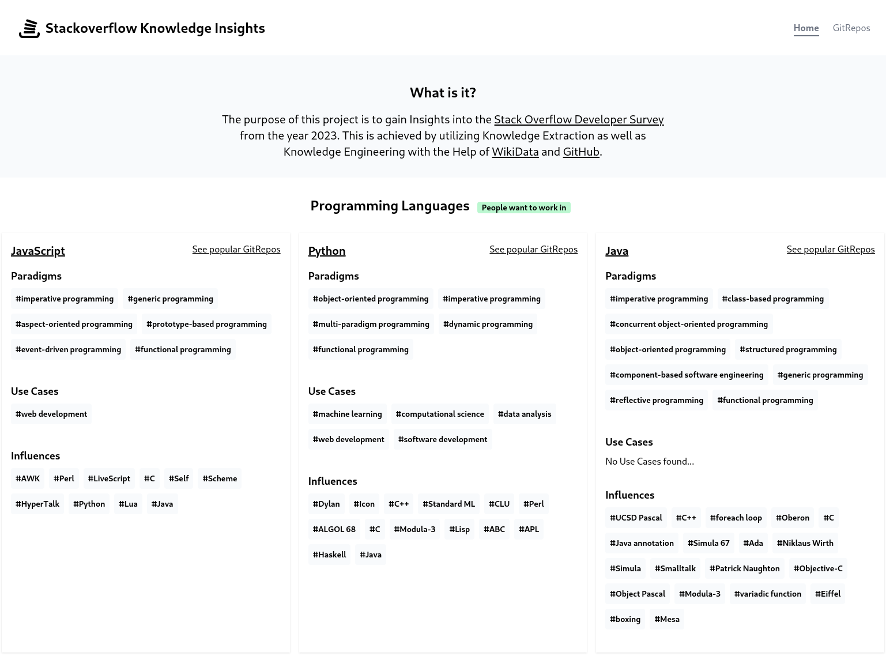
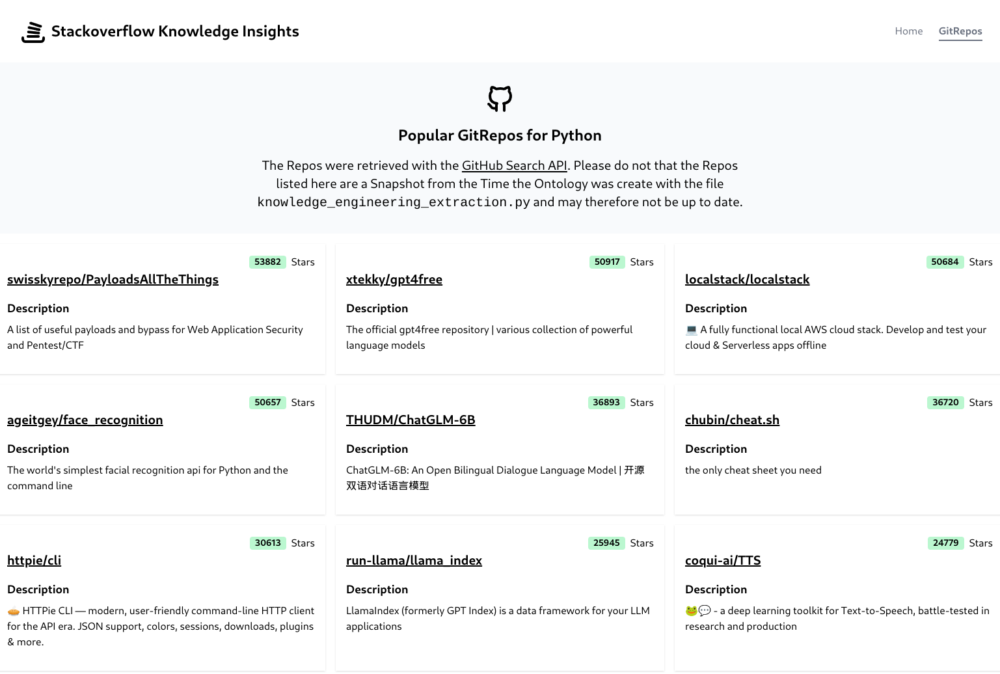

---
titlepage: true
titlepage-color: "ffffff"
titlepage-rule-color: "ffffff"
titlepage-text-color: "000000"
toc-own-page: false
colorlinks: false
title: Projektarbeit Knowledge Engineering and Extraction 
subtitle: Darstellung von populären Programmiersprachen auf Basis der Stack Overflow Umfrage aus dem Jahr 2023 
author:
- Yannick Hutter 
lang: de
date: "13.01.2024"
lof: true
lot: true
bibliography: references.bib
csl: apastyle.csl
mainfont: Liberation Sans
sansfont: Liberation Sans
monofont: JetBrains Mono
header-left: "\\small \\thetitle"
header-center: "\\small \\leftmark"
header-right: "\\small \\theauthor"
footer-left: "\\leftmark"
footer-center: ""
footer-right: "\\small Seite \\thepage"
...

\newpage
# Aufgabenstellung und Zielsetzung {#chapter:aufgabenstellung-zielsetzung}

Ein wichtiges Auswahlkriterium für Programmierer ist die korrekte Wahl der Programmiersprache. Eine Programmiersprache zu lernen benötigt Zeit und Übung. Umso wichtiger ist es, dass diese Entscheidung bewusst getroffen wird. Die Arbeit hat das Ziel, eine Visualisierung zu erstellen, welche Programmierern bei diesem Entscheidungsschritt unterstützen soll. Eine populäre Plattform für Programmierer, auf welcher Fragen zu Programmierproblemen gestellt werden können ist Stack Overflow. Ein Hauptmerkmal von Stack Overflow ist die grosse Community von rund 22 Millionen (Stand 13.01.2024) Mitgliedern [@StackOverflowMemberCount2023]. Stack Overflow führt zudem **jährliche** Umfragen durch. In diesen Umfragen werden diverse Programmieraspekte thematisiert, unter anderem auch die verwendeten Programmiersprachen. Die vorliegende Arbeit nutzt als Ausgangsbasis den Datensatz aus der Umfrage im **Jahr 2023**, welche von rund 90'000 Personen ausgefüllt wurde [@StackOverflowSurvey2023].

# Datenbasis
Wie bereits in Kapitel \ref{chapter:aufgabenstellung-zielsetzung} erwähnt, dient die Stack Overflow Umfrage aus dem Jahr 2023 als primäre Datengrundlage. Der Datensatz liegt im **CSV** (Comma-separated values) vor. Von den Personen welche den Datensatz ausgefüllt haben, sind rund 75% beruflich als Programmierer tätig (siehe Abbildung \ref{fig:aufteilung-umfrageteilnehmer}). 

![Aufteilung Umfrageteilnehmer [@StackOverflowMethodology2023]](./images/aufteilung-umfrageteilnehmer.png){#fig:aufteilung-umfrageteilnehmer}

Bei den Daten selbst handelt es sich um einen **multivariaten Datensatz** mit rund 84 Spalten und 90'000 Zeilen. Der Autor hat sich hierbei auf die Attribute **LanguageHaveWorkedWith** sowie **LanguageWantToWorkWith** fokussiert. Die Bedeutung der ausgewählten Attribute kann der Tabelle \ref{table:beschreibung-der-attribute} entnommen werden.

|**Attribut**|**Beschreibung**|
|---|------|
|LanguageHaveWorkedWith| Beschreibt die Programmiersprachen, mit welchen die Teilnehmer bereits *gearbeitet haben*.|
|LanguageWantToWorkWith| Beschreibt die Programmiersprachen, mit welchen die Teilnehmer *gerne arbeiten wollen*.|
: Beschreibung der ausgewählten Attribute \label{table:beschreibung-der-attribute}

Das Ziel besteht hierbei darin, die populärsten Programmiersprachen zu ermitteln, d.h. jene Programmiersprachen welche am meisten angegeben worden sind. Diese Programmiersprachen sollen als Ausgangsbasis für die weiteren Schritte wie Knowledge Engineering und Knowledge Extraction dienen.

## Datenbereinigung
Für die Datenbereinigung wurde ein entsprechendes Python Script geschrieben (siehe Script **clean_data.py** [@GithubRepo2024]). Das Script durchläuft folgende Prozessschritte:

* Auswahl der relevanten Attribute
* Zählen wieviel mal jede Programmiersprache pro Attribut erwähnt wurde (jeweils für Top 10)
* Herausfiltern von enthaltenen Antworten (gekennzeichnet mittels "N/A")
* Generierung einer **JSON** (JavaScript Object Notation) Datei für bessere Lesbarkeit und Reduktion der Dateigrösse

Die generierte JSON Datei beinhaltet pro Attribut jeweils die Programmiersprache, sowie die Anzahl der Nennungen.

```json
{
	"languagesPeopleHaveWorkedWith": [{
            "language": "JavaScript",
            "count": 55711
        },
    ],
	"languagesPeopleWantToWorkWith": [{
            "language": "Python",
            "count": 34715
        },
    ]
}
```
Mithilfe des Scripts konnte die Dateigrösse von rund **158.6 MB** auf **1.71 kB** reduziert werden.

# Knowledge Engineering
Die bereinigte Datenbasis bildet die Grundlage für das Knowledge Engineering. Ziel des Knowledge Engineering ist es, die Programmiersprachen mit weiteren Informationen anzureichern. Als Datenquelle wurde die **SPARQL Schnittstelle von Wikidata** verwendet. Als Python Bibliothek wird **rdflib** verwendet. Die erste Herausforderung besteht darin, eine Beziehung zwischen der Bezeichnungen der Programmiersprachen (bspw. Python), sowie Entitäten von Wikidata (bspw. Q28865) herzustellen.

Hierzu wurde ein SPARQL Query geschrieben. In einem ersten Schritt werden sämtliche Entitäten, welche Instanzen (wdt:P31) von *Computer Language* (wd:Q629206) sind geholt. Anschliessend werden die Labels sowohl in **englischer** als auch **deutscher** Sprache mit der Bezeichnung der Programmiersprache verglichen. Dieser Schritt war notwendig, da bspw. die "Programmiersprache" **CSS** auf Englisch unter dem Begriff **Cascading Style Sheets** gefunden wird, auf Deutsch hingegen der Begriff **CSS** verwendet wird. Generell besitzen die englischen Bezeichnungen eine bessere Trefferquote. Der String *%programming_language%* wird dynamisch durch die Bezeichnung der Programmiersprachen ersetzt (siehe Script **knowledge_engineering_extraction.py** [@GithubRepo2024]).

```sql
SELECT DISTINCT ?programming_language ?programming_language_label WHERE {
    SERVICE <https://query.wikidata.org/sparql> {
      ?programming_language wdt:P31 ?instance_type;
                            rdfs:label ?programming_language_label.

      # instance of computer language
      # The * goes up the inheritance hierarchy until it finds a match
      ?instance_type wdt:P279* wd:Q629206.

      # For example CSS is called Cascading Style Sheets in english and CSS in german etc.
      # Therefore we check both languages while also ignoring casing
      FILTER((LANG(?programming_language_label) = "en" || LANG(?programming_language_label) = "de") && REGEX(str(?programming_language_label), "%programming_language%", "i"))
    }
}
LIMIT 1000
```
\newpage
Der SPARQL Query kann **mehrere Resultate pro Programmiersprache** zurückliefern. In solch einem Fall wird jener Treffer genommen, welcher genau der Bezeichnung der Programmiersprache entspricht:

```python
...
for query_language, query_label in result:
    # Do a simple match exactly by name and pick that one
    if query_label.strip() == language:
        print(f"Found matching language {query_language} => {query_label}")
        programming_language_subjects[query_label] = query_language
        found_match = True
        break
...
```

Jede Programmiersprache wird anschliesend um die Attribute **Use Case**, **Paradigma** und **Influence** angereichert. Eine genaue Beschreibung der Attribute kann der Tabelle \ref{table:beschreibung-der-hinzugefügten-attribute-wikidata} entnommen werden.

|**Wikidata ID**|**Attribut**|**Beschreibung**|
|---|--|------|
|has use (wdt:P366)|Use Case|Beschreibt die *Anwendungsgebiete* der Programmiersprache genauer|
|programming paradigm (wdt:P3966)|Paradigma|Beschreibt welche *Programmierparadigmen* die Programmiersprache unterstützt|
|influenced by (wdt:P737)|Influence|Beschreibt durch *welche anderen Programmiersprachen* eine spezifische Programmiersprache *beeinflusst wurde*|
: Beschreibung der hinzugefügten Attribute aus Wikidata \label{table:beschreibung-der-hinzugefügten-attribute-wikidata}

## Definition der Ontologie
Um die Programmiersprachen sowie die angereicherten Informationen (Use Case etc.) abzubilden, wurde eine entsprechende Ontologie erstellt. Hierzu wurde das Programm **Protégé** verwendet. Zuerst wurden die verschiedenen **Klassen** abgebildet. Bei der Erstellung der Klassen wurde darauf geachtet, dass auf **bestehende Entitäten von Wikidata verwiesen wurde** ( siehe Bezug *ComputerLanguage* zu *Q629206* in Abbildung \ref{fig:verweis-wikidata-entity}). Eine genaue Beschreibung der Klassen kann der Tabelle \ref{table:beschreibung-der-klassen} im Anhang entnommen werden. Nebst den eigentlichen Klassen wurden auch **Object Properties** (siehe Abbildung \ref{fig:object-properties}) sowie **Data Properties** (siehe Abbildung \ref{fig:data-properties}) definiert. Eine genauere Beschreibung kann den Tabellen \ref{table:beschreibung-data-properties} sowie \ref{table:beschreibung-object-properties} im Anhang entommen werden. Sowohl bei den Object, als auch Data Properties wurde auf eine Wiederverwendung der bestehenden Wikidata Properties geachtet. Eine Graph Darstellung der Ontologie ist unter folgendem [Link](https://github.com/yhutter-dv/fhgr-so-programming-languages/tree/main/backend/data) verfügbar.

{#fig:verweis-wikidata-entity height=150px}

{#fig:object-properties height=150px}

{#fig:data-properties height=150px}

## Verwendung der definierten Ontologie
Die mit Protégé erstellte Ontologie wurde anschliessend im **RDF** Format als Datei *base_ontology.rdf* abgespeichert. Mithilfe der Pythonbibliothek **owlready2** konnte die Ontologie wieder eingelesen werden. Der Vorteil hierbei ist, dass auf Basis der Ontologie direkt entsprechende Python Klassen erstellt werden. Der untere Quellcode (zusammengekürzter Ausschnitt aus der Datei **knowledge_engineering_extraction.py**) illustriert das Hinzufügen von verschiedenen Use Cases pro Programmiersprache. Die Klasse **onto.ProgrammingLanguageUseCase** ist direkt aus der Ontologie erzeugt worden und musste nicht selbst implementiert werden. Auch werden die Object und Data Properties automatisch erzeugt.

```python
 with onto:
    use_cases = []
    for use_case_label, use_case_subject in use_case_subjects.items():
        print(f"{use_case_label} => {use_case_subject}")
        use_case = onto.ProgrammingLanguageUseCase(use_case_label, wikiDataUrl=[str(use_case_subject)])
        use_cases.append(use_case)
    programming_language.useCase = use_cases
```

# Knowledge Extraction
Für den Knowledge Extraction Teil wurden die Programmiersprachen noch um **populäre Github Repositories** erweitert. Hierzu wurde die REST-Schnittstelle der **Github Search API** verwendet [@GithubSearchApi2023]. Mithilfe dieser Schnittstelle wurden pro Programmiersprache jeweils die **10 populärsten** Github Repositories evaluiert. Der Vorteil dieser Schnittstelle besteht darin, dass die Daten in einem **strukturierten JSON Format** zurückgegeben werden. Fehleranfälligkeiten in Bezug auf Änderungen im Format sollten somit minimiert werden können. Der Zugriff auf die Daten erfolgte mithilfe der **requests** Bibliothek und eines entsprechenden Github PAT Tokens.

```python
query_string = f"language:{programming_language}&sort=stars&order=desc&per_page={number_of_results}&page=1"
url = f"{GITHUB_SEARCH_API}/repositories?q={query_string}"
headers = {
    "X-GitHub-Api-Version": "2022-11-28",
    "Authorization": SECRETS["GITHUB_API_TOKEN"],
}
response = requests.get(url, headers=headers)
response_json = response.json()
...
```
Ein limitierender Faktor hierbei war das **Rate Limit** der Github Search API. Ein Rate Limit begrenzt die Anzahl an Requests, welcher in einer bestimmten Zeit ausgeführt werden können. Um dem Rate Limit entgegenzuwirken wurden entsprechende Pausen zwischen den Requests eingebaut.

# Gesamtüberblick
Ziel dieses Kapitels ist es einen Gesamtüberblick über die Thematiken der vorherigen Kapitel zu verschaffen. Zu Beginn wurde das Script **clean_data.py** ausgeführt. Dieses sorgt dafür, dass aus dem Stack Overflow Datensatz eine kleinere kompakte JSON Datei generiert wird, welche nur die relevanten Attribute, sowie die **populärsten 10 Programmiersprachen** beinhaltet. Nun folgt der Knowlege Engineerung und Knowledge Extraction Teil, welche durch das Script **knowledge_engineering_extraction.py** abgedeckt werden. Zu Beginn wird die Basis Ontologie (**base_ontology.rdf**), welche mithilfe von Protégé erstellt wurde eingelesen. Anschliessend nutzt das Script die generierte JSON Datei und sucht über die SPARQL Schnittstelle von Wikidata passende Wikidata Entitäten anhand der Bezeichnung der Programmiersprache. Anschliessend werden mithilfe der Wikidata Entitäten weitere Informationen zu den Programmiersprachen wie **Paradigm**, **Influence** sowie **Use Case** ergänzt. Zum Schluss werden noch pro Programmiersprache populäre Github Repositories mithilfe der Github Search API herangezogen und auch entsprechend ergänzt. Sämtliche Informationen werden dann als Ontologie mit dem Namen **output_ontology.rdf** abgespeichert.
Der gesamte Ablauf ist in Abbildung \ref{fig:knowledge-engineering-extraction} ersichtlich.

{#fig:knowledge-engineering-extraction height=300px}


# Visuelle Darstellung
Um die generierte Ontologie dem interessierten Programmierer visuell zugänglich zu machen, wurde mithilfe des **Fresh Frameworks** ein Frontend implementiert [@DenoFreshFramework2023]. Das Frontend ist hierbei mithilfe von *TypeScript*, *HTML* und *CSS* realisiert worden. Nebst dem Frontend wurde mithilfe der Python Bibliothek **FastAPI** eine entsprechende Kommunikationsschnittstelle geschaffen [@FastAPI2023]. Die Kommunikationskette zwischen Frontend und Backend ist in Abbildung \ref{fig:frontend-backend} ersichtlich.

{#fig:frontend-backend height=120px}

## Kommunikationsschnittstelle
Über die Kommunikationsschnittstelle stehen dem Frontend folgende Möglichkeiten zur Verfügung:

* Abfrage von Programmiersprachen, welche Programmierer bereits verwenden
* Abfrage von Programmiersprachen, welche Programmierer gerne verwenden würden
* Abfrage von Github Repositories zu einer bestimmten Programmiersprache

Diese Abfragen werden über entspechende Endpunkte ermöglicht (siehe Abbildung \ref{fig:fastapi}).

{#fig:fastapi height=200px}

Die Resultate der Abfragen werden im **JSON Format** zurückgegeben. Die FastAPI Schnittstelle nutzt als Datengrundlage die Datei **output_ontology.rdf**. Um beispielsweise sämtliche Programmiersprachen zu ermitteln, in **denen Personen bereits gearbeitet haben**, genügt folgender Code

```python
def get_programming_languages_people_are_working_with():
    languages = []
    with ONTOLOGY:
        for element in filter_out_fusion_class(ONTOLOGY.ProgrammingLanguagePeopleHaveWorkedWith.instances()):
            language = create_programming_language_from_onto_element(element)
            languages.append(language)
    return languages
```

## Frontend
Das Frontend bietet zwei Hauptbereiche. Über den **Home** Bereich erhält der Nutzer eine Übersicht über populäre Programmiersprachen (siehe Abbildung \ref{fig:frontend-home}). 

{#fig:frontend-home height=300px}


Zu jeder Programmiersprache stehen jeweils *Paradigmen*, *Use Cases* sowie *Influences* zur Verfügung. Klickt man auf den Namen der Programmiersprache, so wird man auf die **entsprechende Wikidata Seite weitergeleitet**. Dies gilt auch für Paradigmen, Use Cases und Influences. Klickt der Nutzer auf *See popular GitRepos*, so wird der Nutzer auf den **GitRepos** Bereich weitergeleitet.

Im GitRepos Bereich werden populäre Github Repositories zur entsprechenden Programmiersprache dargestellt (siehe Abbildung \ref{fig:frontend-gitrepos}).

{#fig:frontend-gitrepos height=300px}

Wird auf den Namen des Repositories geklickt, so wird der Nutzer direkt zum entsprechende Link auf Github weitergeleitet. Auch steht eine Kurzbeschreibung als Informationsquelle zur Verfügung. Die Repositories sind ebenfalls absteigend nach Popularität sortiert.

# Fazit und Limitationen
Beginnen möchte ich mein Fazit mit der Bemerkung, dass es von zentraler Bedeutung ist, auf welcher Abstraktionsebene man die SPARQL Queries ausführt. In meinem Fall habe ich zu Beginn den Fehler gemacht, dass die SPARQL Queries nur Entitäten von **ProgrammingLanguage** berücksichtigten. So habe ich zu Beginn nicht die korrekten Ergebnisse erhalten. Die Lösung für dieses Problem war, dass die Entitäten vom Typ **ComputerLanguage** (Elternklasse von ProgrammingLanguage). Ein weiteres wichtiges Learning für mich ist die Arbeit mit den Python Bibliotheken **rdflib** und **owlready2**. Diese Bibliotheken haben mir sehr viel Arbeit abgenommen. Auch konnte ich die generierte RDF Datei im Backend wiederverwenden. Durch die Erstellung einer Visualisierung sind mir jedoch noch Unstimmigkeiten im aufgefallen. So gibt es beispielsweise keine Anwendungsfälle für die Programmiersprache Java, was ich mir fast nicht vorstellen kann. Durch das Feedback, welches ich bei der Präsentation erhalten habe, konnte ich kleine Verbesserungen, wie das Sortieren der Github Repositories nach Popularität, vornehmen. Das Projekt hat noch viel Verbesserungspotenzial. Das Script **knowledge_engineering_extraction.py** beispielsweise kann dahingehend optimiert werden, dass bereits einmal durchlaufene Programmiersprachen nicht nochmals abgefragt werden (Überschneidungsmenge zwischen Programmiersprachen in denen Personen bereits arbeiten vs. Programmiersprachen in denen sie gerne arbeiten möchten). Das würde die Laufzeit des Scripts stark reduzieren und auch unnötige Calls in Richtung Github Search API minimieren, was vorallem unter Berücksichtigung des strikten Rate Limits von Vorteil ist. Auch ist die Bibliothek owlready2 nur als Klassengenerator verwendet worden. Diese Bibliothek bietet beispielsweise auch die Möglichkeit ein **Reasoning** durchführen zu können.

Alles in allem bin ich jedoch mit dem Endresultat des Projektes zufrieden und kann daher ein positives Schlussfazit ziehen.

# Quellenverzeichnis

::: {#refs}
:::

# Anhang

|**Klasse**|**Beschreibung**|
|---|------|
|ComputerLanguage|Oberklasse aller Programmiersprachen|
|ProgrammingLanguage|Unterklasse von ComputerLanguage, definiert eine spezifische Programmiersprache|
|ProgrammingLanguagePeopleHaveWorkedWith|Unterklasse von ProgrammingLanguage. Definiert eine Programmiersprache, mit welcher die befragten Personen **bereits gearbeitet haben**|
|ProgrammingLanguagePeopleWantToWorkWith|Unterklasse von ProgrammingLanguage. Definiert eine Programmiersprache, mit welcher die befragten Personen **gerne arbeiten wollen**|
|ProgrammingLanguageInfluencedBy|Programmiersprache, von welcher eine andere Programmiersprache beeinflusst wurde|
|ProgrammingLanguageParadigm|Paradigmen, welcher von einer Programmiersprache unterstütz werden|
|ProgrammingLanguagePopularRepo|Ein Github Repository welches einer Programmiersprache zugeordnet werden kann|
|ProgrammingLanguageUseCase|Ein mögliches Anwendungsgebiet einer Programmiersprache|
: Beschreibung der Klassen \label{table:beschreibung-der-klassen}

|**Data Property**|**Beschreibung**|
|---|------|
|repoDescription|Kurztextbeschreibung eines Github Repositories|
|repoName|Name eines Github Repositories|
|repoNumberOfStars|Anzahl Sterne (Popularität) eines Github Repositories|
|repoUrl|URL eines Github Repositories|
|wikiDataUrl|Wikidata URL einer Klasse|
: Beschreibung der Data Properties \label{table:beschreibung-data-properties}

|**Object Property**|**Beschreibung**|
|---|------|
|influencedBy|Von welchen Programmiersprachen eine bestimmte Programmiersprache beeinflusst wurde|
|useCase|Anwendungsfälle für eine bestimmte Programmiersprache|
|paradigm|Programmierparadigmen für eine bestimmte Programmiersprache|
|popularRepo|Populäre Github Repositories für eine bestimmte Programmiersprache|
: Beschreibung der Object Properties \label{table:beschreibung-object-properties}